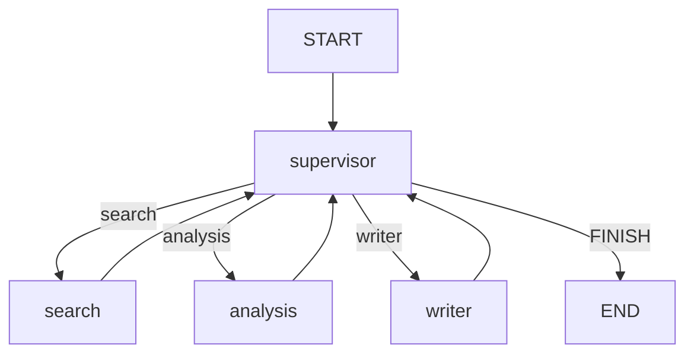

# Architecture — Multi-Agent Research & Report Generator

## Overview

This project is a full-stack research app:

- **LangGraph backend** coordinates supervisor, search, analysis, and writer agents.
- **FastAPI** exposes job creation, status, history, cancel, and SSE streaming endpoints.
- **Next.js** renders the research workspace, agent pipeline, recent reports, markdown report viewer, and PDF export.
- **SQLite** stores both LangGraph checkpoints and job metadata/history.
- **Tavily** is the recommended search provider, with DuckDuckGo fallback.

```mermaid
flowchart LR
  user[User] --> web[Next.js UI]
  web --> api[FastAPI API]
  api --> service[Job service]
  service --> graph[LangGraph]
  graph --> supervisor[Supervisor]
  supervisor --> search[Search agent]
  supervisor --> analysis[Analysis agent]
  supervisor --> writer[Writer agent]
  search --> tavily[Tavily or DuckDuckGo]
  service --> jobs[(jobs.db)]
  graph --> checkpoints[(checkpoints.db)]
  writer --> reports[reports/*.md]
```

## Runtime Flow

1. User submits a topic in the web UI or CLI.
2. `POST /research` creates a job record and starts a background worker thread.
3. The worker streams LangGraph node updates through `service.py`.
4. Job metadata is persisted to `.checkpoints/jobs.db`.
5. Graph state is checkpointed to `.checkpoints/checkpoints.db`.
6. Completed markdown is written to `reports/{thread_id}.md`.
7. The UI receives status through SSE (`/research/{thread_id}/stream`) with polling fallback.

## LangGraph



| Node | Responsibility |
|------|----------------|
| `supervisor` | Routes work and enforces step budget |
| `search` | Runs multi-query web search and fetches source pages |
| `analysis` | Compares options, ranks recommendations, flags gaps |
| `writer` | Produces markdown report with summaries, tables, citations |

## Persistence

| Store | File | Purpose |
|-------|------|---------|
| LangGraph checkpoint | `.checkpoints/checkpoints.db` | Graph state by `thread_id` |
| Job metadata | `.checkpoints/jobs.db` | Status, topic, steps, report path, timestamps |
| Markdown reports | `reports/{thread_id}.md` | Completed report content |

`JobStore` hydrates completed report metadata from `reports/*.md` when needed, so the UI can show report history after restart.

## API

| Method | Path | Description |
|--------|------|-------------|
| `GET` | `/health` | Health check |
| `POST` | `/research` | Start or retry a job |
| `GET` | `/research` | Recent job/report history |
| `POST` | `/research/{thread_id}/cancel` | Cooperative cancellation |
| `GET` | `/research/{thread_id}/stream` | SSE status snapshots |
| `GET` | `/status/{thread_id}` | Polling fallback/status snapshot |

Cancellation is cooperative: it stops before the next graph node starts, but cannot interrupt an in-flight LLM or search call.

## Frontend

The Next.js UI is centered on `web/components/research/research-workspace.tsx`:

- `TopicForm` — multi-line topic input and 3–500 character validation
- `ActivityPanel` — current work, step budget, cost/budget status
- `AgentPipeline` — accessible stepper/progress
- `ReportHistory` — recent persisted jobs/reports
- `ReportViewer` — GFM markdown rendering and PDF export

## Deployment

Local development runs API and web separately. Docker Compose runs both:

```bash
docker compose up --build
```

The web container uses `API_URL=http://api:8000` for server-side rewrites. Local development defaults to `http://localhost:8000`.
