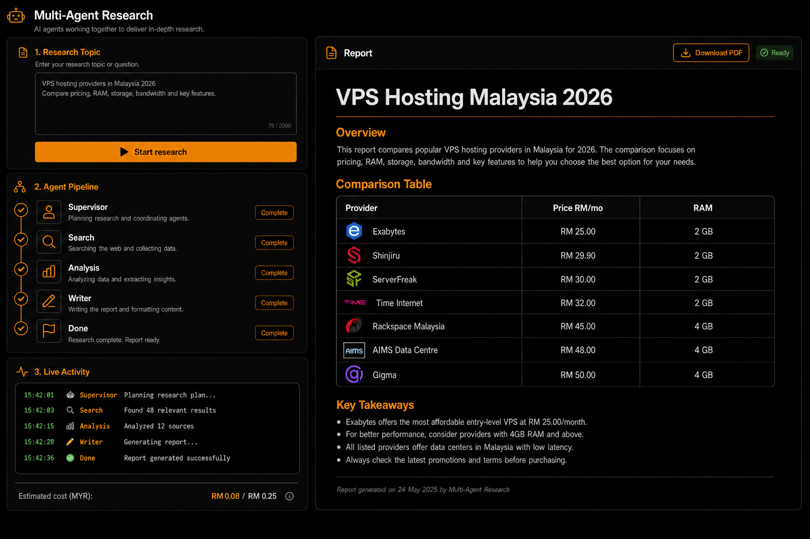

# Multi-Agent Research & Report Generator

A **LangGraph-powered multi-agent system** that researches any topic, analyzes findings, and compiles structured reports — autonomously.

Built with a **supervisor agent** that orchestrates specialist workers (search, analysis, writing), connected through a `StateGraph` with checkpointed memory. Includes a **FastAPI backend** and **Next.js web UI**.



*Black UI with agent pipeline, live activity (MYR budget), and structured report output. See [sample report](docs/sample-report.md).*

```
Supervisor ──→ Search ──→ Analysis ──→ Writer ──→ Done
                 ↑            │            │
                 └────────────┴────────────┘
                     all return to supervisor
```

---

## Tech Stack

| Layer | Tech |
|-------|------|
| Agents | LangGraph 1.x, LangChain |
| LLM | OpenRouter (default: `google/gemini-2.5-flash`) |
| API | FastAPI + uvicorn |
| UI | Next.js 16, Tailwind CSS, shadcn/ui |
| Search | Tavily API (recommended) or DuckDuckGo fallback |
| Persistence | SQLite checkpointer (`.checkpoints/`) |

---

## Prerequisites

- **Python 3.10+**
- **Node.js 18+** (for the web UI)
- An **OpenRouter API key** ([openrouter.ai](https://openrouter.ai))
- A **Tavily API key** ([tavily.com](https://tavily.com)) — free tier available; strongly recommended for better research quality

---

## Quick Start (Full Stack)

Run the API and UI in **two terminals**.

### 1. Clone & configure

```bash
git clone https://github.com/rrusyaidii/multi-agent-research.git
cd multi-agent-research

# Python virtual environment
python -m venv venv
source venv/bin/activate        # Linux / Mac
.\venv\Scripts\activate         # Windows

# Install backend + API + test deps
pip install -e ".[api,test]"

# Environment variables
cp .env.example .env
# Edit .env — set OPENROUTER_API_KEY and TAVILY_API_KEY
```

### 2. Terminal 1 — API server (port 8000)

```bash
research-api
# or: uvicorn research_agent.api:app --reload --port 8000
```

Verify: `curl http://localhost:8000/health` → `{"status":"ok"}`

### 3. Terminal 2 — Web UI (port 3000)

```bash
cd web
npm install
npm run dev
```

Open **http://localhost:3000**, enter a topic, and watch the agent pipeline run. The finished report appears in the right panel and is saved to `reports/{thread_id}.md`. Use **Download PDF** to export.

---

## Docker Quick Start

For a one-command full-stack run:

```bash
cp .env.example .env
# Edit .env — set OPENROUTER_API_KEY and TAVILY_API_KEY

docker compose up --build
```

Then open **http://localhost:3000**. The API runs on **http://localhost:8000**. Reports and checkpoints are mounted to local `reports/` and `.checkpoints/`.

---

## CLI Only (no UI)

```bash
pip install -e .

# Single research run
python -m research_agent "AI agents market trends 2026"

# With thread ID (checkpoint continuity)
python -m research_agent "Rust vs Go for backend" --thread-id rust-go-01

# JSON output (matches API shape)
python -m research_agent "Best frameworks for agentic AI" --format json
```

---

## Environment Variables

Copy [`.env.example`](.env.example) to `.env` and fill in:

| Variable | Required | Description |
|----------|----------|-------------|
| `OPENROUTER_API_KEY` | Yes | Your OpenRouter API key |
| `TAVILY_API_KEY` | Recommended | Tavily Search API key — much better results than DuckDuckGo |
| `SEARCH_PROVIDER` | No | `tavily` (default if key set) or `duckduckgo` |
| `TAVILY_MAX_RESULTS` | No | Max Tavily results per query (default: 8) |
| `TAVILY_SEARCH_DEPTH` | No | `basic` or `advanced` (default: advanced) |
| `OPENROUTER_MODEL` | No | Default: `google/gemini-2.5-flash` |
| `MAX_LLM_CALLS` | No | Step budget per session (default: 30) |
| `MAX_COST_PER_SESSION_MYR` | No | Estimated cost cap in Ringgit (default: `0.25`) |
| `ESTIMATED_COST_PER_LLM_CALL_MYR` | No | Per LLM-call estimate for budget display (default: `0.01`) |
| `API_HOST` / `API_PORT` | No | API bind address (default: `0.0.0.0:8000`) |
| `CORS_ORIGINS` | No | Allowed origins (default: `http://localhost:3000`) |

The UI proxies `/api/*` → `http://localhost:8000` via Next.js rewrites, so CORS is only needed for direct API access.

### Search quality (v2)

For comparison topics like "VPS hosting Malaysia", set up Tavily:

```env
SEARCH_PROVIDER=tavily
TAVILY_API_KEY=tvly-your-key-here
TAVILY_SEARCH_DEPTH=advanced
```

Without Tavily, the agent falls back to DuckDuckGo HTML scraping (lower quality, snippet-only results).

---

## Testing

```bash
python -m pytest tests/ -v
cd web
npm run lint
npm run test
npm run build

# Browser E2E with mocked API responses
npx playwright install
npm run test:e2e
```

Live OpenRouter/Tavily tests are intentionally not part of default CI to avoid using API credits.

---

## Project Structure

```
multi-agent-research/
├── src/research_agent/
│   ├── graph.py          # LangGraph StateGraph
│   ├── supervisor.py     # Routing agent
│   ├── service.py        # Shared job runner (CLI + API)
│   ├── api.py            # FastAPI endpoints
│   ├── cli.py            # CLI entry point
│   ├── job_store.py      # SQLite job metadata/history
│   ├── agents/           # search, analysis, writer
│   └── tools/            # web_search, web_fetch, tavily_search
├── web/                  # Next.js frontend
├── docs/sample-report.md # Example output shape
├── tests/
├── reports/              # Generated markdown reports (gitignored)
└── .checkpoints/         # SQLite session state (gitignored)
```

---

## What NOT to commit

These are in [`.gitignore`](.gitignore) — keep them local:

| Path | Why |
|------|-----|
| `.env` | Contains your API keys |
| `.checkpoints/` | Local SQLite session database |
| `reports/` | Generated report output |
| `web/node_modules/`, `web/.next/` | Frontend build artifacts |
| `web/.env.local` | Local frontend overrides |
| `venv/`, `.venv/` | Python virtual environment |

---

## API Endpoints

| Method | Path | Description |
|--------|------|-------------|
| `GET` | `/health` | Health check |
| `POST` | `/research` | Start research job `{ "topic": "..." }` |
| `GET` | `/research` | List recent jobs/reports |
| `POST` | `/research/{thread_id}/cancel` | Cooperatively cancel a running job |
| `GET` | `/research/{thread_id}/stream` | Server-sent status updates |
| `GET` | `/status/{thread_id}` | Poll job status, steps, report |

---

## Current Product Features

- Multi-line topic input with 3–500 character validation
- Recent report history backed by SQLite job metadata
- Cooperative cancel to stop before the next expensive graph step
- SSE status streaming with polling fallback
- GFM report rendering with scrollable tables and code blocks
- Direct PDF download

See [sample report](docs/sample-report.md) for the expected report shape.

---

<p align="center">
  Built with LangGraph — Haziq Rusyaidi • 2026
</p>
